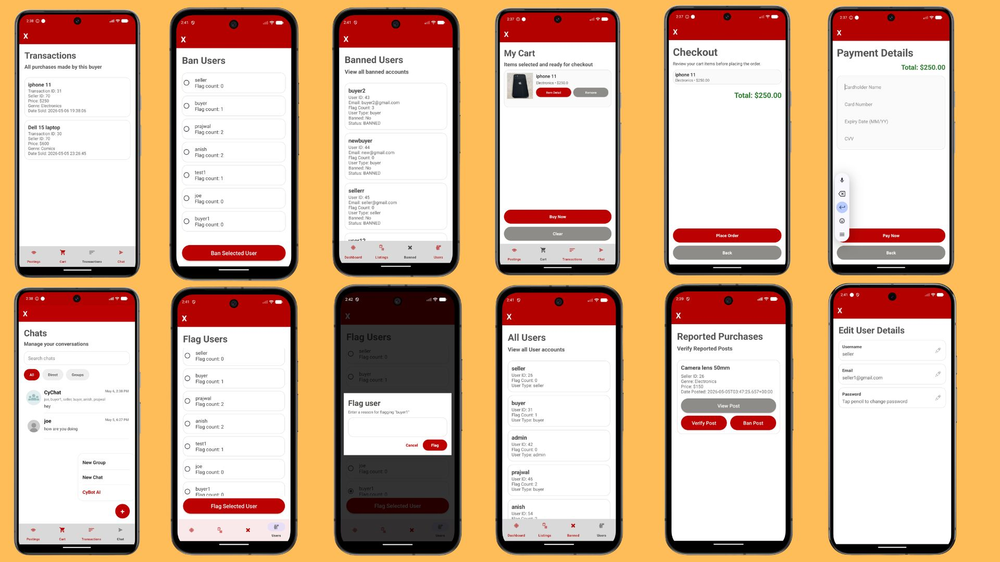
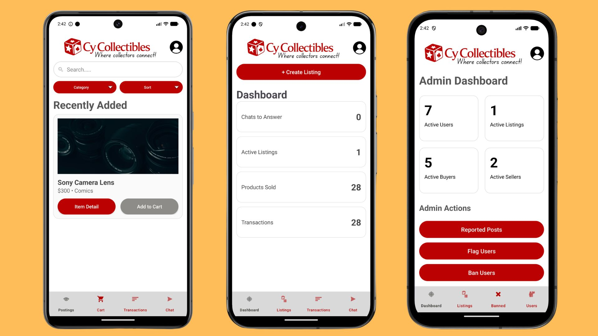
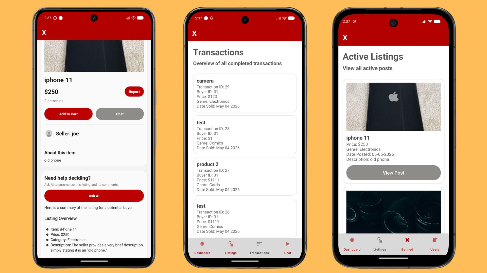
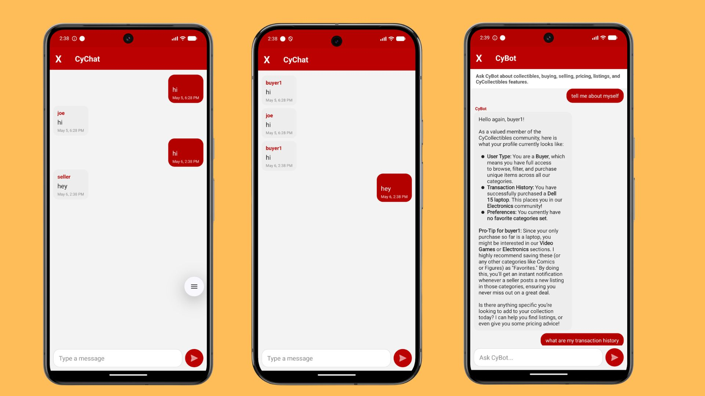
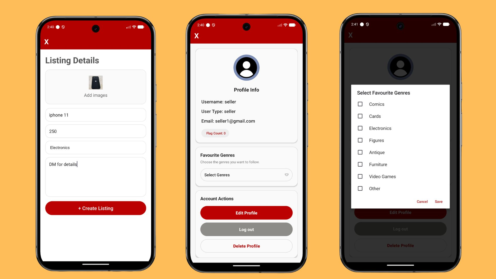

# Cy Collectibles

Cy Collectibles is an Android marketplace where collectors can discover, buy, and sell collectibles. The application supports buyer, seller, and administrator accounts, with real-time messaging and AI-assisted listing tools.

## Features

- Browse, search, filter, and sort collectible listings
- Create listings with photos, prices, categories, and descriptions
- Manage a shopping cart and complete purchases
- View buyer and seller transaction histories
- Send direct and group messages through WebSockets
- Ask CyBot for personalized recommendations and account information
- Generate AI summaries for listings
- Follow favorite collectible categories
- Report listings and moderate users through an administrator dashboard

## Screenshots

### Application overview



### Marketplace and dashboards



### Listings, transactions, and AI assistance



### Messaging and CyBot



### Listing creation and profile settings



## Technology

| Component | Technologies |
| --- | --- |
| Android client | Java, Android SDK 33, Material Components, Volley, OkHttp, Glide |
| Backend API | Java, Spring Boot 3.4, Spring Data JPA, REST, WebSockets |
| Database | MariaDB |
| AI | Google Gemini API |
| Testing | JUnit, Espresso, REST Assured, MockWebServer |

## Project structure

```text
.
├── Backend/springboot_example/          # Spring Boot API and backend tests
├── Frontend/tutorials-android_unit1_3_login_signup/
│   └── AndroidExample/                  # Main Android application
├── Documents/                           # Diagrams, documentation, and coverage reports
└── Experiments/                         # Team development experiments
```

## Getting started

### Requirements

- Java 17 or newer
- Maven 3.9 or newer
- MariaDB
- Android Studio with Android SDK 33
- A Gemini API key for AI features

### Run the backend

Configure the database and Gemini credentials as environment variables:

```bash
export SPRING_DATASOURCE_URL="jdbc:mariadb://localhost:3306/cycollectibles_db"
export DB_USERNAME="your_database_username"
export DB_PASSWORD="your_database_password"
export GEMINI_API_KEY="your_gemini_api_key"
```

Start the API:

```bash
cd Backend/springboot_example
mvn spring-boot:run
```

The backend runs on `http://localhost:8080`. Swagger UI is available at `http://localhost:8080/swagger-ui-custom.html`.

### Run the Android application

1. Open `Frontend/tutorials-android_unit1_3_login_signup/AndroidExample` in Android Studio.
2. Update `BASE_URL` in `app/build.gradle` so it points to the backend. Use `http://10.0.2.2:8080` when the backend runs on the same computer as the Android emulator.
3. Sync the Gradle project.
4. Run the `app` configuration on an emulator or Android device running API 24 or newer.

To build from the command line:

```bash
cd Frontend/tutorials-android_unit1_3_login_signup/AndroidExample
./gradlew assembleDebug
```

## Testing

Run the backend test suite:

```bash
cd Backend/springboot_example
mvn test
```

Run the Android unit tests:

```bash
cd Frontend/tutorials-android_unit1_3_login_signup/AndroidExample
./gradlew test
```

Run the Android instrumented tests with an emulator or device connected:

```bash
./gradlew connectedAndroidTest
```

## Security

Database credentials and API keys are loaded from environment variables. Do not commit credentials or local configuration containing secrets.
